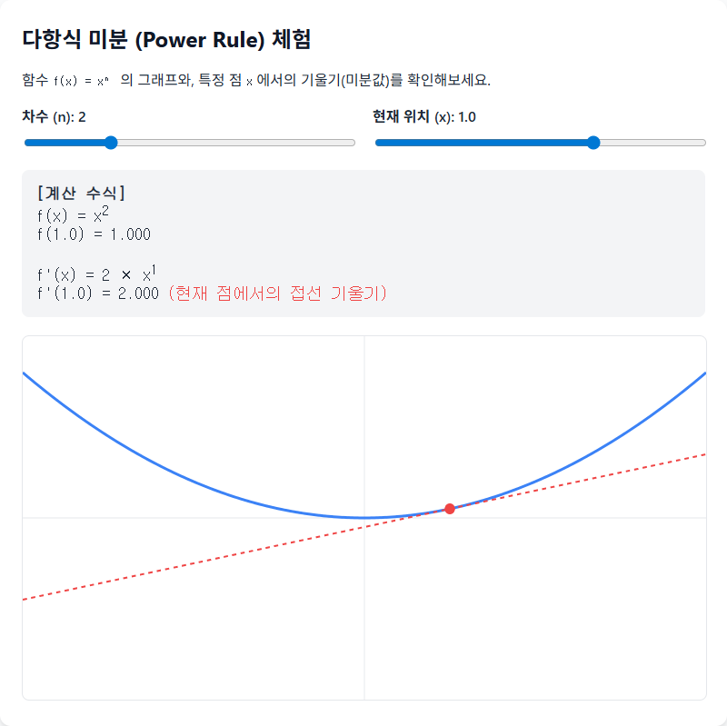
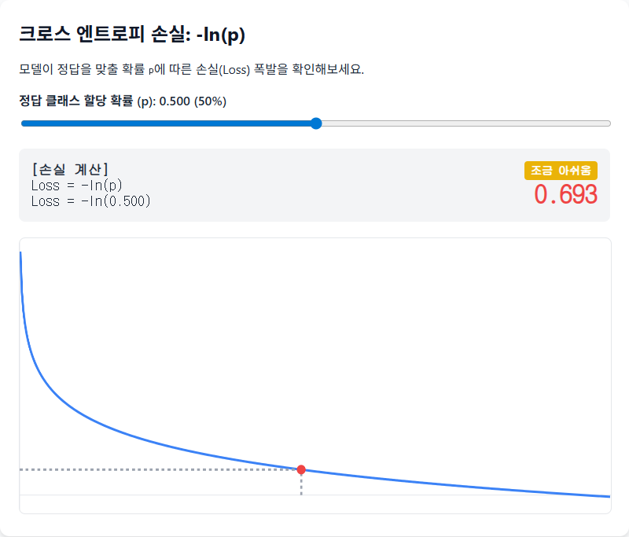
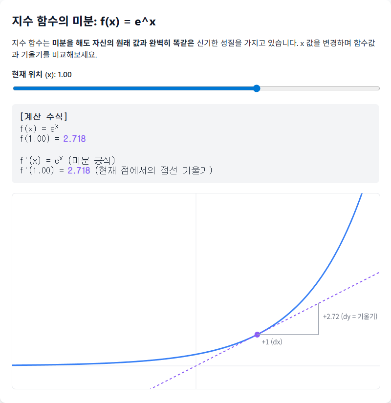
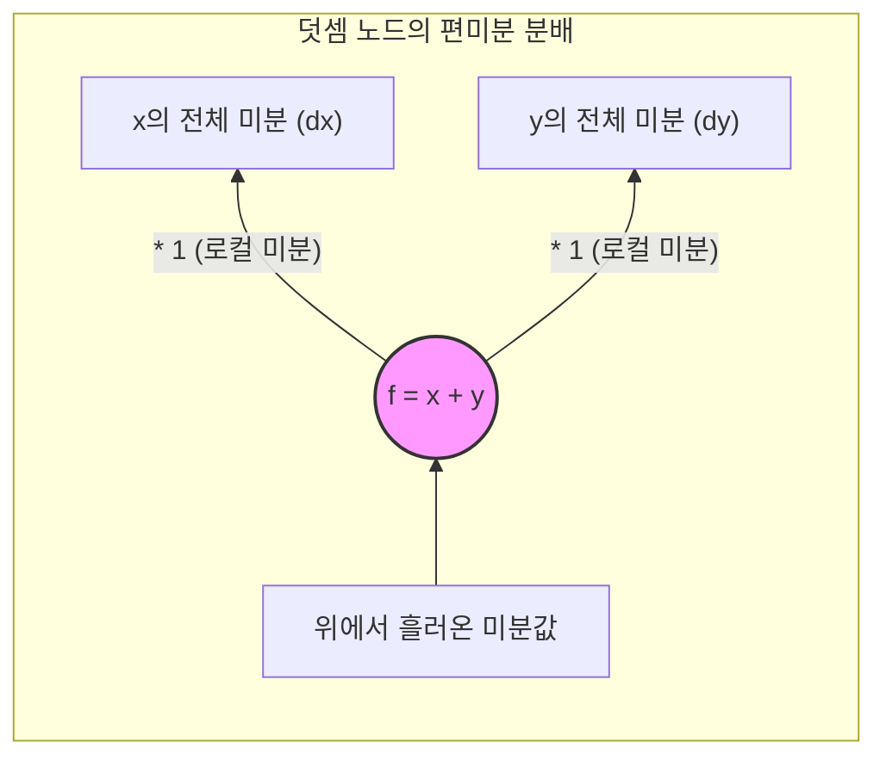
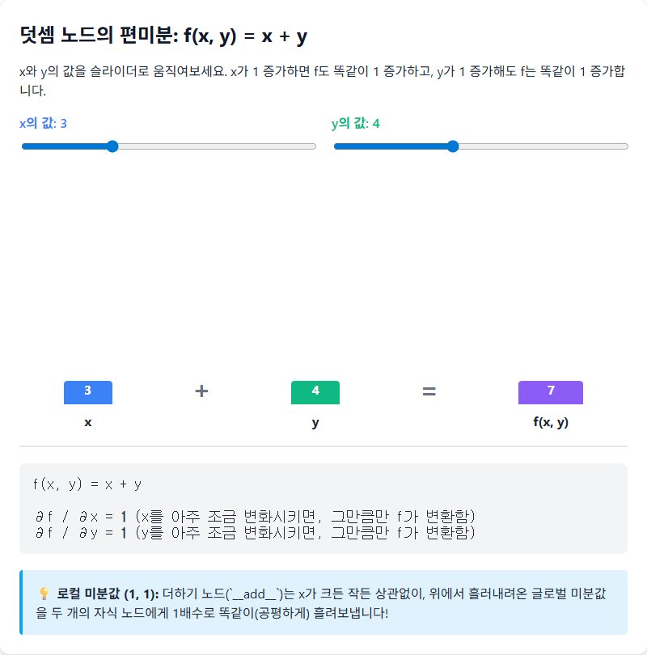
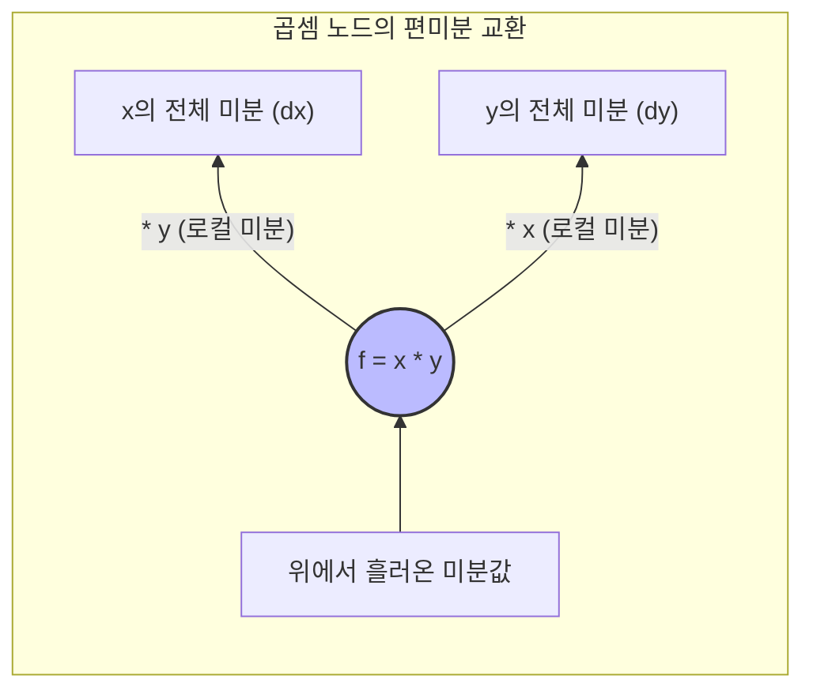
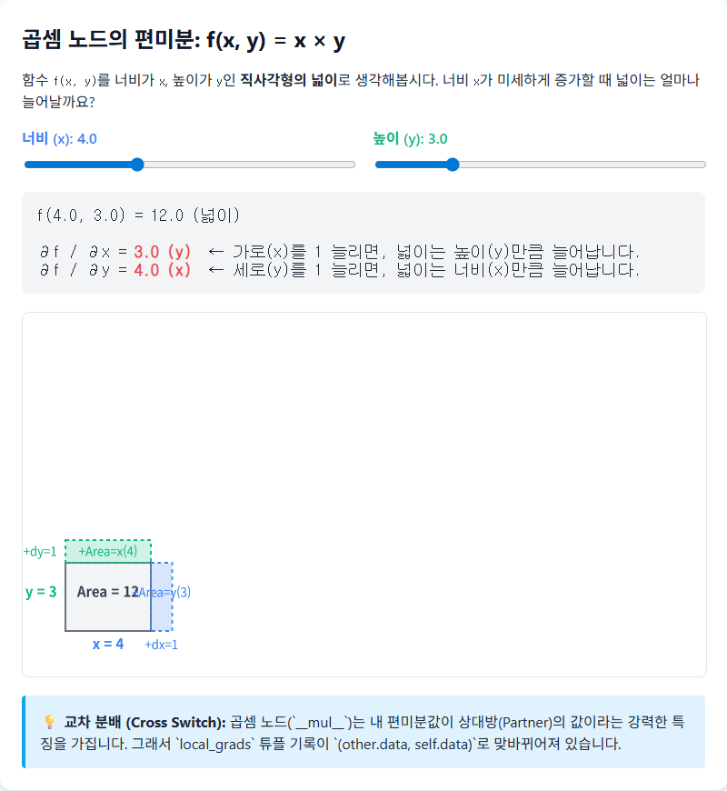

# Chapter 1. 기초 함수와 미분법 (Calculus)

딥러닝의 역전파 알고리즘을 코딩하기 위해서 너무 깊은 미분적분학 지식이 전부 필요하지는 않습니다. 우리가 코딩할 수식 단위를 구성하는 몇 개의 핵심 기초 함수의 "미분 공식" 세 가지만 정확히 알면 됩니다.

> 📝 **미분이란?** 특정 순간(현재 지점)에서, 입력값 $x$를 개미 눈물만큼(미세하게) 움직였을 때 $y$의 결과값이 얼마나 가파르게 변하는지(기울기)를 나타내는 값.

## 1-1. 다항식의 미분 (Power Rule)과 `__pow__` 연결
어떤 수를 $n$번 거듭 제곱하는 연산($f(x) = x^n$)은 신경망의 분산 수식, L2 규제, 손실 함수 등에서 광범위하게 쓰입니다.

* **수학 공식**: $f(x) = x^n$ 을 미분하면 $f'(x) = n \cdot x^{n-1}$
* **ex)** $x^3 \rightarrow 3x^2$, $x^2 \rightarrow 2x$

> ✅ **실제 값 적용 예제 (`f = x**3`)**
> * **입력값**: $x = 2.0$ (코드상 `self.data = 2.0`)
> * **상수(n)**: $3$ (코드상 `other = 3`)
> * **순전파 계산값**: $f(2.0) = 2.0^3 = 8.0$
> * **로컬 미분값 계산**: $n \times x^{n-1} \rightarrow 3 \times 2.0^{3-1} = 3 \times 4.0 = \mathbf{12.0}$
> * 즉, 현재 $x$ 값이 2.0일 때 나 자신을 미세하게 변화시키면 그 결과물은 12배만큼 커지며 반응합니다!

**💻 코드 반영 (`__pow__` 의 지역 미분):**
```python
    def __pow__(self, other):
        # other는 상수 (n) 역할을 합니다.
        return Value(
            self.data**other, 
            (self,), 
            # 미분 공식 [n * x^(n-1)] 이 그대로 local_grads 가 됩니다.
            (other * self.data**(other-1),)
        )
```

> 🔗 [인터랙티브 체험: 다항식 미분과 접선](viz/viz_01_power_rule.html)
> 
> 


## 1-2. 자연로그 함수의 미분과 `log()`
분류(Classification) 문제를 풀 때 정답의 확률 분포와 우리의 확률 분포 차이를 계산하는 크로스 엔트로피 손실(Cross-Entropy Loss)에 주로 사용됩니다.
자연로그 함수는 밑이 $e$(오일러 수 $\approx 2.718$)인 로그 $\ln x$ 입니다.

* **수학 공식**: $f(x) = \ln(x)$ 를 미분하면 $f'(x) = \frac{1}{x}$

**💻 코드 반영 (`log()` 의 지역 미분):**
```python
    def log(self):
        return Value(
            math.log(self.data), 
            (self,), 
            # 1/x 의 미분 공식을 튜플에 담아 자기 자신에게 기록합니다.
            (1/self.data,)
        )
```

> 🔗 [인터랙티브 체험: 자연로그와 손실함수](viz/viz_02_log_and_loss.html)
> 
> 

## 1-3. 지수 함수의 미분 (Exponential)과 `exp()`
소프트맥스(Softmax)를 구하거나 시그모이드(Sigmoid) 함수를 만들 때 필수적으로 쓰이는 $f(x) = e^x$ 입니다. 
지수 함수는 특이하게도 미분을 해도 영구히 자신의 오리지널 값과 형태가 똑같습니다.

* **수학 공식**: $f(x) = e^x$ 를 미분하면 $f'(x) = e^x$

**💻 코드 반영 (`exp()` 의 지역 미분):**
```python
    def exp(self):
        return Value(
            math.exp(self.data), 
            (self,), 
            # 미분값이 원본 함수 결과와 완벽하게 같습니다.
            (math.exp(self.data),)
        )
```

> ✅ **실제 값 적용 예제 (`f = exp(x)`)**
> * **입력값**: $x = 1.0$ (코드상 `self.data = 1.0`)
> * **순전파 계산값**: $e^{1.0} \approx 2.718$
> * **로컬 미분값 계산**: $e^x \rightarrow e^{1.0} \approx \mathbf{2.718}$
> * 지수 함수 맵핑 특성상, 미분값(기울기)이 결과값과 동일하게 나오는 특별한 성질을 확인할 수 있습니다!

> 🔗 [인터랙티브 체험: 지수 함수의 신비](viz/viz_03_exp.html)
> 
> 

---

# Chapter 2. 다변수 함수와 편미분 (Partial Derivative)

우리가 만든 코드는 `c = a + b` 나 `d = a * b` 처럼 두 개 이상의 변수가 모여 하나의 결론을 냅니다.
이때 $a$ 가 $c$에 미친 영향력과 $b$ 가 $c$에 미친 영향력을 **각각 쪼개서** 구하는 것이 **편미분**입니다.

## 2-1. 편미분이란? (상수 취급하기)
함수에 변수가 여러 개(예: $x, y$)일 때, 하나의 변수에 대해서만 미분하고 나머지 변수는 고정된 숫자(상수)인 척 취급하는 계산법입니다. 기울기를 구할 타겟 변수를 지정하는 기호 $\frac{\partial}{\partial x}$ 델(Del)을 사용합니다. 

* 예시: $f(x,y) = x^2 \times y$ 일 때,
  * $x$ 로 편미분($\frac{\partial f}{\partial x}$) 하면, $y$ 는 단순한 곱셈 상수 취급되어 $2xy$ 가 됩니다.
  * $y$ 로 편미분($\frac{\partial f}{\partial y}$) 하면, $x^2$ 는 상수 취급되어 $y$의 미분(1)만 일어나 결과는 $x^2$ 가 됩니다.


## 2-2. 덧셈 노드의 편미분 ($a + b$)
$f = x + y$ 의 수식입니다.
* $x$ 의 입장에서 편미분해봅니다. $y$ 는 상수니 날아가고(0), $x$의 미분은 결국 1이 됩니다! $\rightarrow \frac{\partial f}{\partial x} = 1$
* $y$ 의 입장에서 편미분해도 마찬가지입니다. $\rightarrow \frac{\partial f}{\partial y} = 1$

**💡 결론**: 더하기 노드에서는 자신을 구성하는 두 자식 노드들에게 1:1로 공평하게(동일하게) 1배의 영향력을 미칩니다. (기울기를 그대로 흘려보냅니다.)

> ✅ **실제 값 적용 예제 (`f = x + y`)**
> * **입력값**: $x = \mathbf{-4.0}$, $y = \mathbf{2.0}$
> * **순전파 계산값**: $f(-4.0, 2.0) = -4.0 + 2.0 = -2.0$
> * $x$ 의 로컬 미분값 $\frac{\partial f}{\partial x}$ = 상수 **1.0** (y값이 무엇이든, x는 오직 순수한 덧셈 요소이므로)
> * $y$ 의 로컬 미분값 $\frac{\partial f}{\partial y}$ = 상수 **1.0**
> * 더하기 노드는 $x$ 의 실제 값이 아주 크건 아주 작건 상관없이 공평하게 1의 로컬 영향력을 배분하는 "기울기 분배기(Distributor)" 역할을 합니다.




**💻 코드 반영 (`__add__`):**
```python
    def __add__(self, other):
        # ...
        # self도 로컬 미분값이 1, other도 로컬 미분값이 1 입니다.
        return Value(self.data + other.data, (self, other), (1, 1))
```

> 🔗 [인터랙티브 체험: 덧셈의 공평한 분배](viz/viz_04_partial_add.html)
> 
> 

## 2-3. 곱셈 노드의 편미분 ($a \times b$)
$f = x \times y$ 의 수식입니다.
* $x$ 의 입장에서 편미분해봅니다. $y$ 는 단순 상수 계수가 되어 달라붙어 구석에 남아있으므로 결과는 $y$가 됩니다. $\rightarrow \frac{\partial f}{\partial x} = y$
* $y$ 의 입장에서 편미분해봅니다. 반대로 $x$가 남습니다. $\rightarrow \frac{\partial f}{\partial y} = x$

**💡 결론**: 곱셈 노드에서는 자신들의 원래 값을 **서로 맞바꾼 크기만큼(Cross)** 영향을 지니게 됩니다! $x$가 크면 $y$의 기울기가 커지는 시소 구조를 갖습니다.

> ✅ **실제 값 적용 예제 (`f = x * y`)**
> * **입력값**: $x = \mathbf{3.0}$, $y = \mathbf{-2.0}$
> * **순전파 계산값**: $f(3.0, -2.0) = 3.0 \times -2.0 = -6.0$
> * $x$ 의 로컬 미분값 $\frac{\partial f}{\partial x}$ = 내 파트너 값인 **$y(-2.0)$**
> * $y$ 의 로컬 미분값 $\frac{\partial f}{\partial y}$ = 내 파트너 값인 **$x(3.0)$**
> * 즉, 나($x$)의 영향력은 내 파트너($y$)의 몸집에 의해 결정되는 "기울기 스위칭"이 일어납니다!



**💻 코드 반영 (`__mul__`):**
```python
    def __mul__(self, other):
        # ...
        # (self 위치의 로컬 그래디언트는 other의 값, other 위치의 그래디언트는 self의 값)
        return Value(self.data * other.data, (self, other), (other.data, self.data))
```

---
| [목록으로 (Plan)](01_plan.md) | [다음 챕터 (Chapter 3)](03_chapter_03.md) → |

> 🔗 [인터랙티브 체험: 곱셈의 값 교환](viz/viz_05_partial_mul.html)
> 
> 
