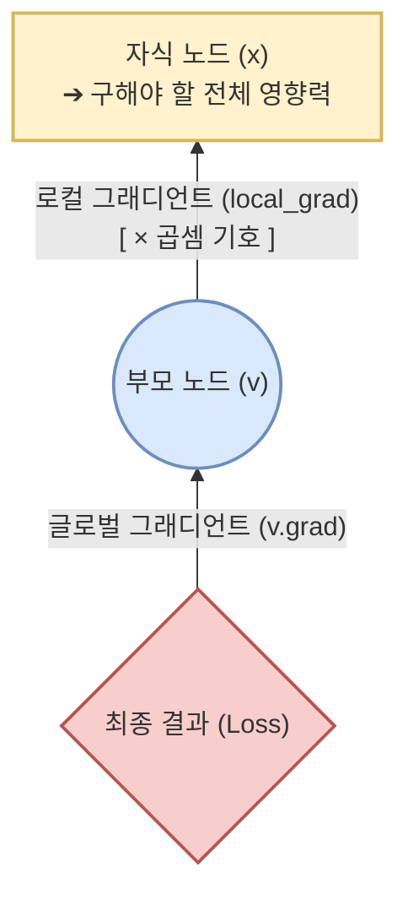
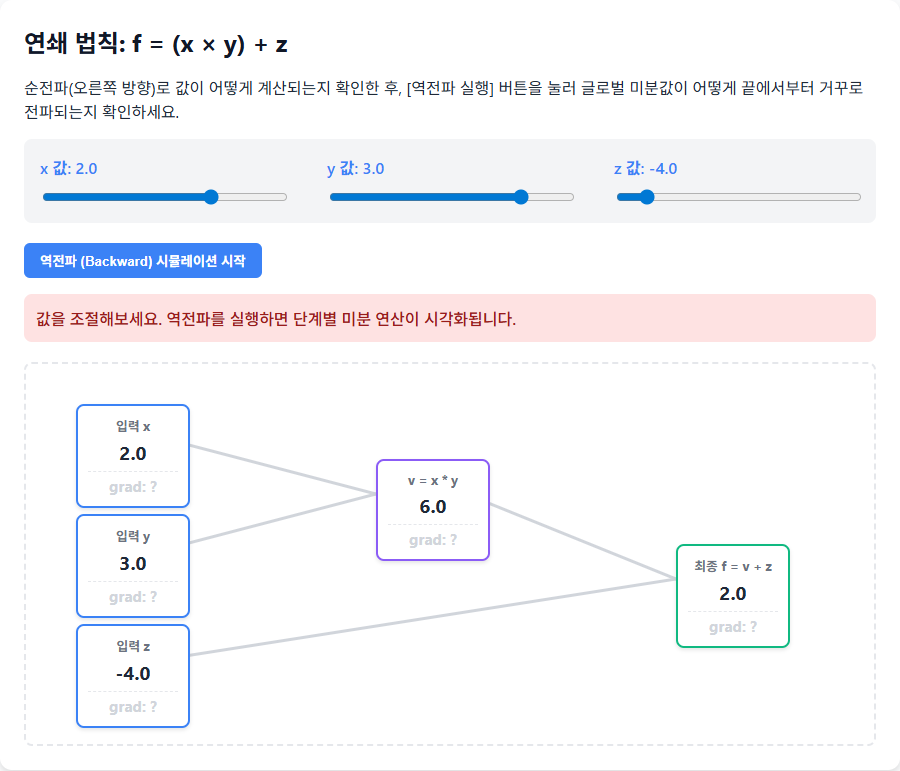
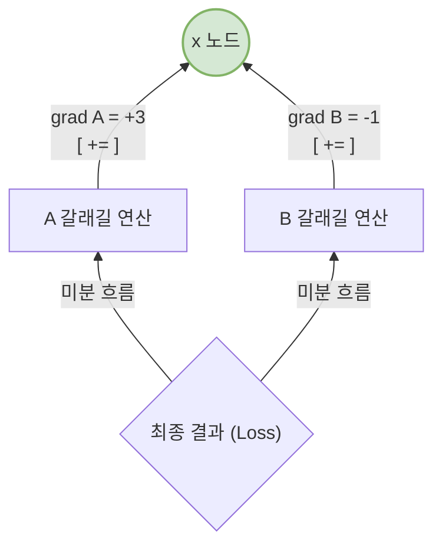

# Chapter 3. 연쇄 법칙 (Chain Rule, 핵심 엔진)

딥러닝의 핵심인 **역전파(Backpropagation)** 알고리즘을 코드로 짜게 만들어주는 가장 위대한 수학적 마법, 바로 `체인 룰(연쇄 법칙)`입니다. "어떻게 $x$가 $f(x)$를 거쳐 복잡한 맨 마지막 결과(오차값, Loss)에 미치는 영향력을 한 방에 구할 수 있을까?"에 대한 해답을 알려줍니다.

## 3-1. 합성 함수(Composite Function)의 미분
우리는 두 가지 이상 간단한 수식이 합쳐져 연달아 일어나는 형태를 '합성' 이라고 부릅니다. 
예를 들어 $g(x) = x \times 2$ 이고 $f(g) = g^3$ 라면, 최종적으로 우리 함수는 $f(g(x)) = (x \times 2)^3$ 껍질 속에 둘러싸여 진 형태가 됩니다.

**연쇄 법칙의 원리**: 이처럼 가장 바깥 함수의 입력이 다시 안쪽 함수의 출력일 때, 맨 바깥에서부터 맨 안쪽까지 각 함수의 미분값을 껍질을 벗겨내며 '차례대로 곱해 나간다($\times$)'는 법칙입니다.

수학 기호로 쓰면 이렇게 됩니다. "결과값인 $f$에 대한 최초의 입력 $x$의 미세한 변화 비율($\frac{df}{dx}$)은, 중간 지점인 $g$가 미친 영향($\frac{df}{dg}$)에 방금 본 $x$가 $g$에 미친 영향($\frac{dg}{dx}$)을 곱한 것과 같다."

$$\frac{\partial f}{\partial x} = \frac{\partial f}{\partial g} \times \frac{\partial g}{\partial x}$$

## 3-2. 로컬 그래디언트와 글로벌 그래디언트의 분리
파이썬 코드로 이 수식을 객체 지향적으로 녹여내기 위해서는, **'내가 아는 사실'과 '나에게 넘어올 사실'을 완벽하게 분리**해야 합니다.

1. **로컬 그래디언트 (나만의 미분값, Local Gradient)** $\rightarrow$ $\frac{\partial g}{\partial x}$
   * **현재의 노드($x$)가 바로 위 부모 노드($g$)의 결과물에 미친 극히 좁은 영향력**만을 뜻합니다.
   * "나는 전체 망은 모르겠어. 어쨌든 $g(x) = x \times 2$ 니까 내가 1 변하면 내 윗단 수식($g$)은 2 만큼 변해. 내 지역 그래디언트는 `2`야."
   * 💡 **코드 속 위치**: `__init__` 에 쓰이는 `_local_grads` 에 당당히 적어둡니다. (예: `(1, 1)` 이나 `(other.data, self.data)`)

2. **글로벌 그래디언트 (나에게서 전체까지의 미분값, Global Gradient)** $\rightarrow$ $\frac{\partial f}{\partial x}$
   * **가장 바깥 결과(Loss, $f$)에서부터 현재 나($x$)에게 도달하기까지의 기나긴 전체 영향력**입니다.
   * "맨 마지막 손실(Loss)이 나한테 흘러왔는데, 지금까지의 누적 영향력($\frac{df}{dg}$)이 `10`이라네."
   * 💡 **코드 속 위치**: 역전파(`backward()`) 과정 중에 누적되어 `self.grad` 변수에 최종적으로 저장되는 바로 그 숫자입니다.

3. **연쇄 법칙의 객체 지향적 완성 (Chain Rule Coding)**:
   * 나($x$)의 전체 그래디언트 (`child.grad`)는 = (내가 위로 미친 로컬 영향력 `local_grad`) $\times$ (내 위를 덮고 있는 부모가 넘겨준 글로벌 미분값 `v.grad`) 가 되는 것입니다.

> ✅ **실제 값 적용 예제 (`f = (x * y) + z`)**
> * **입력값**: $x=2.0$, $y=3.0$, $z=4.0$
> * **중간식($v$)**: $v = x \times y = 6.0$
> * **최종식($f$)**: $f = v + z = 10.0$
> 
> * **[역전파 1단계]** 맨 끝단 $f$의 `grad`를 1.0으로 설정합니다. (`f.grad = 1.0`)
> * **[역전파 2단계 (덧셈 노드)]**: $f = v + z$ 이므로 덧셈의 로컬 미분값은 각각 `1.0`입니다.
>   * $v$의 글로벌 그래디언트 (`v.grad`) = $f$에서 넘어온 글로벌(1.0) $\times$ 자신의 로컬(1.0) = **1.0**
>   * $z$의 글로벌 그래디언트 (`z.grad`) = $f$에서 넘어온 글로벌(1.0) $\times$ 자신의 로컬(1.0) = **1.0**
> * **[역전파 3단계 (곱셈 노드)]**: $v = x \times y$ 로 거슬러 올라갑니다. 이 노드의 글로벌 미분값 `v.grad`는 방금 구해진 1.0입니다.
>   * $x$의 로컬 미분값은 파트너인 $y$(3.0)입니다.
>   * $x$의 글로벌 그래디언트 (`x.grad`) = $v$에서 넘어온 글로벌(**1.0**) $\times$ 자신의 로컬(**3.0**) = **3.0**
>   * $y$의 로컬 미분값은 파트너인 $x$(2.0)입니다.
>   * $y$의 글로벌 그래디언트 (`y.grad`) = $v$에서 넘어온 글로벌(**1.0**) $\times$ 자신의 로컬(**2.0**) = **2.0**



```python
# microgpt.py 줄 237-239: 모든 위상 껍질 노드(v)를 거꾸로 돌면서(reversed_topo) 연쇄 법칙 곱셈을 수행!
for v in reversed(topo):
    # 나를 이루는 변수들(child)과, 내가 미리 적어뒀던 로컬 미분값(local_grad)을 꺼냄
    for child, local_grad in zip(v._children, v._local_grads):
        # 자식 노드(child)의 전체 그래디언트에 = '로컬 그래디언트' * '내(부모, v)가 방금 위에서 받은 글로벌 그래디언트'
        child.grad += local_grad * v.grad
```

> 🔗 [인터랙티브 체험: 연쇄 법칙 Step-by-Step](viz/viz_06_chain_rule.html)
> 
> 

## 3-3. 미분값의 누적 (Gradient Accumulation)
위 코드 조각에서 핵심적인 기호가 하나 있습니다. 왜 `child.grad = (대입)` 이 아니라 `child.grad += (누적합)` 을 사용했을까요?

이것을 다변수 연쇄 법칙, 머신러닝에서는 미분값 누적(Gradient Accumulation)이라고 부릅니다.
하나의 변수 $x$가 $A$라는 식에도 쓰이고, 저쪽 멀리 있는 $B$라는 식에도 쓰여서(결과적으로 두 번의 갈래길(Branch)로 나뉘었을 때), 나중에 $Loss$로부터 역전파가 되어 내려오는 미분값의 흐름도 서로 다른 $A$, $B$경로를 타고 두 번 쏴지며 날아오게 됩니다.

* "A쪽으로 뻗어간 가지에서 너(x) 때문에 결과가 `+3` 변했어!"
* "B쪽으로 뻗어간 가지에서 너(x) 때문에 결과가 `-1` 변했어!"

이 경우 변수 $x$ 전체의 순수한 영향력은 이 두 개의 미분값을 더한 `2`가 됩니다. 갈래길로 나뉘었던 영향력이 그대로 합산되는 원리입니다. 그렇기 때문에 딥러닝 코드에서는 노드의 `grad` 속성을 매번 무식하게 덮어쓰지 않고 항상 `+=` 하여 조심스럽게 누적해 주어야만 값이 올바르게 흘러갑니다.



---
| ← [이전 챕터 (Chapter 1, 2)](02_chapter_01_02.md) | [목록으로 (Plan)](01_plan.md) | [다음 챕터 (Chapter 4)](04_chapter_04.md) → |


