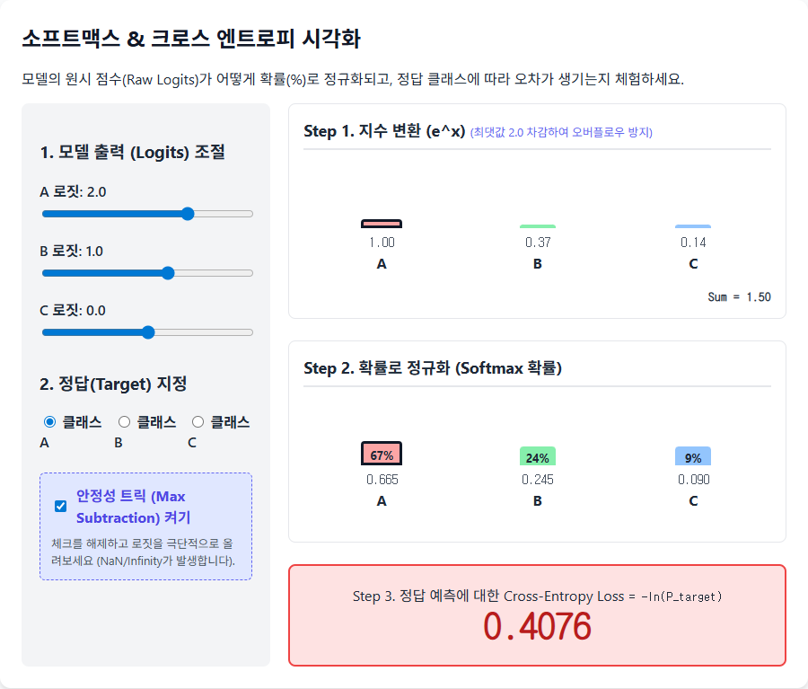

# Chapter 4. 확률 분포와 손실 함수의 수학

GPT는 다음에 올 글자를 \"맞히는\" 모델입니다. 모델이 내놓은 원시 점수(로짓, logit)들을 확률로 바꾸고, 정답과의 차이를 하나의 숫자(손실, loss)로 측정하는 수학이 필요합니다. 이 챕터의 수식들이 `microgpt.py`의 `softmax()` 함수와 `-probs[target_id].log()` 코드에 직접 대응됩니다.

## 4-1. 확률 분포와 소프트맥스(Softmax) 공식

### 확률 분포란?
모든 선택지에 0~1 사이의 값을 부여하되, 전부 합치면 정확히 1이 되는 숫자의 집합을 확률 분포라고 합니다.
- 예: 다음 글자가 `a` 일 확률 0.7, `b` 일 확률 0.2, `c` 일 확률 0.1 → 합계 = 1.0 ✅

### 로짓(Logit)은 확률이 아니다
모델이 출력하는 원시 점수(`logits`)는 `-2.5`, `3.1`, `0.8` 같은 그냥 실수입니다. 음수일 수도 있고, 합이 1이 되지도 않습니다. 이를 확률로 바꾸는 변환 함수가 바로 **소프트맥스(Softmax)**입니다.

### 소프트맥스 수학 공식

$$\text{softmax}(x_i) = \frac{e^{x_i}}{\sum_{j} e^{x_j}}$$

각 입력값에 지수 함수($e^x$)를 씌워서 **무조건 양수로 만든 뒤**, 전체 합으로 나누어 **비율(합이 1)로 정규화**합니다.

> ✅ **실제 값 적용 예제**
> * **입력 로짓**: $[2.0, 1.0, 0.1]$
> * **지수 변환**: $[e^{2.0}, e^{1.0}, e^{0.1}] = [7.389, 2.718, 1.105]$
> * **합계**: $7.389 + 2.718 + 1.105 = 11.212$
> * **소프트맥스 결과**: $[\frac{7.389}{11.212}, \frac{2.718}{11.212}, \frac{1.105}{11.212}] = [0.659, 0.242, 0.099]$
> * 합 = $0.659 + 0.242 + 0.099 = 1.0$ ✅
> * 가장 큰 로짓(2.0)이 가장 높은 확률(0.659)을 가짐!

**💻 코드 반영 (`softmax` 함수):**
```python
def softmax(logits):
    max_val = max(val.data for val in logits)            # 안정성 트릭 (4-3 참조)
    exps = [(val - max_val).exp() for val in logits]    # 각 로짓에 e^x 적용
    total = sum(exps)                                    # 전체 합 계산
    return [e / total for e in exps]                     # 각각을 합으로 나눠 확률화
```


## 4-2. 크로스 엔트로피 손실 (Cross-Entropy Loss)

모델이 내놓은 확률 분포가 정답과 얼마나 다른지를 **하나의 숫자로 측정**하는 함수입니다. 이 숫자가 작을수록 모델이 정답을 잘 맞힌 것이고, 학습의 목표는 이 숫자를 0에 가깝게 줄이는 것입니다.

### 직관적 이해
- 정답 토큰이 `a`이고 모델이 `a`에 **0.9(90%)** 확률을 줬다면 → 잘 맞힘 → 손실 작음
- 정답 토큰이 `a`이고 모델이 `a`에 **0.01(1%)** 확률을 줬다면 → 크게 틀림 → 손실 큼

### 수학 공식
정답 토큰의 인덱스가 $k$이고, 모델이 $k$에 부여한 확률이 $p_k$일 때:

$$\text{Loss} = -\ln(p_k)$$

| $p_k$ (정답 확률) | $-\ln(p_k)$ (손실) | 해석 |
|---|---|---|
| 0.9 | 0.105 | 거의 맞힘 → 손실 아주 작음 |
| 0.5 | 0.693 | 반반 → 중간 손실 |
| 0.01 | 4.605 | 심하게 틀림 → 손실 매우 큼 |
| 0.001 | 6.908 | 거의 완전 실패 |

**💡 핵심**: $-\ln(x)$ 함수는 $x$가 1에 가까울수록 0에 가깝고, $x$가 0에 가까울수록 양의 무한대로 치솟습니다. 즉, 정답에 높은 확률을 줄수록 보상(낮은 손실)을 받고, 낮은 확률을 줄수록 벌(높은 손실)을 받는 구조입니다.

**💻 코드 반영 (`microgpt.py` 387줄):**
```python
# probs: softmax 결과 (확률 리스트)
# target_id: 정답 토큰의 인덱스
# probs[target_id]: 정답 토큰에 모델이 부여한 확률 (Value 객체)
loss_t = -probs[target_id].log()   # -ln(정답확률) = 크로스 엔트로피 손실!
```

> 🔗 [인터랙티브 체험: 소프트맥스와 크로스 엔트로피](viz/viz_07_softmax_ce.html)
> 
> 

## 4-3. 수치 안정성 트릭 (Max Subtraction)

소프트맥스 공식에는 $e^x$가 들어가는데, **$x$가 크면 $e^x$가 천문학적으로 커져서** 컴퓨터가 처리할 수 있는 숫자 범위를 넘어갈 수 있습니다 (오버플로우).

예를 들어 $e^{1000}$은 컴퓨터가 표현할 수 없는 무한대(Inf)가 됩니다.

### 해결책: 최댓값 빼기
로짓 전체에서 최댓값을 뺀 후 소프트맥스를 적용해도, **수학적으로 결과가 완전히 동일**합니다!

$$\frac{e^{x_i - \max(x)}}{\sum_j e^{x_j - \max(x)}} = \frac{e^{x_i} / e^{\max(x)}}{\sum_j e^{x_j} / e^{\max(x)}} = \frac{e^{x_i}}{\sum_j e^{x_j}}$$

분자와 분모에 공통으로 $e^{-\max(x)}$가 곱해져서 상쇄되기 때문입니다.

> ✅ **왜 안전해지는가?**
> * 빼기 전: 로짓이 $[1000, 1001, 999]$ → $e^{1000}$ 은 오버플로우!
> * 빼기 후: 최댓값 1001을 빼면 $[-1, 0, -2]$ → $e^{-1} \approx 0.368$, 안전!
> * 최댓값이 0이 되므로 $e^x$의 결과가 항상 $0 < e^x \leq 1$ 범위에 안착합니다.

**💻 코드 반영 (`softmax` 함수 291줄):**
```python
def softmax(logits):
    # 이 한 줄이 숫자 폭발을 방지하는 안전벨트!
    max_val = max(val.data for val in logits)
    # 각 로짓에서 최댓값을 빼고 exp를 적용 → 오버플로우 방지
    exps = [(val - max_val).exp() for val in logits]
    total = sum(exps)
    return [e / total for e in exps]
```

---

이것으로 Phase 2의 수학 기초가 모두 완성되었습니다! 이제 이 확률 변환과 손실 계산이 실제 신경망 코드 내에서 어떤 위치에 들어가는지, Phase 3에서 딥러닝 아키텍처와 함께 배우게 됩니다.

---
| ← [이전 챕터 (Chapter 3)](03_chapter_03.md) | [목록으로 (Plan)](01_plan.md) | [다음 Phase (Phase 3) 계획서](../phase03_deep_learning/01_plan.md) → |
