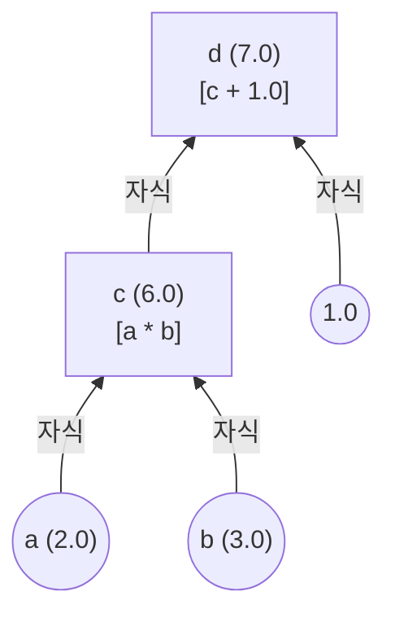
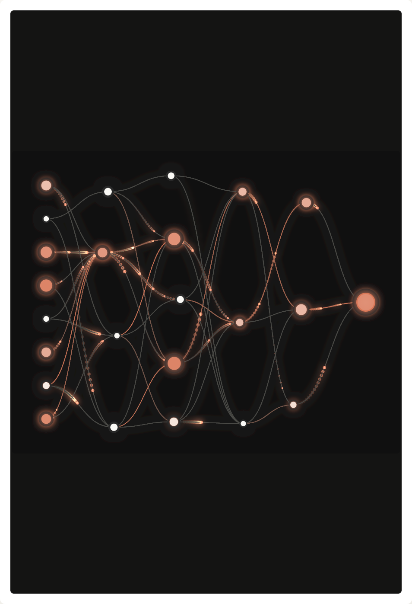

# Chapter 1. 계산 그래프 (Computation Graph)

딥러닝의 복잡한 수식들은 단순한 수식들의 모임입니다. 이러한 수식의 모임을 파이썬 코드로 메모리 상에 그려낸 것이 바로 **계산 그래프(Computation Graph)**입니다. 

## 1-1. 코드가 그리는 그래프의 형태 (트리 구조)
앞선 Phase 1에서 우리가 만든 `Value` 클래스는 `__add__` 나 `__mul__` 연산을 할 때 껍데기만 새로 만드는 것이 아니라, 자기가 어떤 녀석들에게서 태어났는지(`_children`)를 튜플에 담아 기록합니다.

```python
a = Value(2.0)
b = Value(3.0)
c = a * b   # 이 순간 c는 조용히 a와 b를 자신의 _children 으로 기억합니다!
d = c + 1.0 # d는 c와 Value(1.0)을 _children 으로 기억합니다.
```

이렇게 끝없이 꼬리에 꼬리를 물며 변수들이 연결되는 구조는 마치 나뭇가지가 갈라지는 것과 같아 트리(Tree) 또는 그래프(Graph) 자료구조라고 불립니다.

## 1-2. 방향성 비순환 그래프 (DAG, Directed Acyclic Graph)
신경망의 구조는 수학적으로 **DAG** 라는 형태를 띠어야만 합니다.
* **방향성(Directed)**: `a`와 `b`가 합쳐져서 조상 노드인 `c`로 흘러가는 명확한 족보(화살표 방향)가 있습니다.
* **비순환(Acyclic)**: `c`가 어떤 식을 돌고 돌아 다시 자식 노드인 `a`로 연결되면 안 됩니다! 영원히 뱅글뱅글 맴돌게 되어 미분값이 무한루프에 빠지기 때문입니다.




# Chapter 2. 순전파 (Forward Pass)

위와 같이, 데이터를 처음 입력받아서 계산 그래프 위를 한 칸씩 앞으로 전진하며 **값(`value`)**을 계산해 나가는 과정을 **순전파(Forward Pass)**라고 부릅니다. 

## 2-1. 평가와 결과물 생성
신경망을 실행한다는 것은, 코드를 통해 순전파를 끝까지 밀어붙여 맨 마지막 결과 노드(`Loss`, 오차)의 스칼라 값(`self.data`) 하나를 구하는 행위입니다.

> ✅ **실제 순전파 예제 (`microgpt.py`의 흐름)**
> * `token_id` 와 `pos_id` (데이터)가 들어옴.
> * 임베딩(토큰을 실수로 바꿈)을 타고 `x` 리스트가 생성됨.
> * 어텐션 노드(`q, k, v`) 계산 노드들이 곱해지고 더해지며 로짓(`logits`) 생성.
> * 마지막에 `-probs[target_id].log()` 을 거쳐 최종 `loss` (오차)가 계산됨. 
> 
> * **이 수만 번의 수학 연산 과정에서 매 순간 새로운 `Value` 객체들이 탄생하며 거대한 지도를 몰래 완성하고 있습니다.**

## 2-2. 그래프의 암묵적 완성
중요한 점은 파이토치나 우리가 짠 `microgpt.py`같은 동적(Dynamic) 프레임워크는, 그래프의 모양을 파이프라인처럼 미리 그려두고 데이터를 흘리는 방식이 아닙니다. 
**그저 순전파 파이썬 코드가 한 줄씩 위에서 아래로 실행될 때마다(Evaluate), 실시간으로 `Value` 객체들이 생성되며 메모리상에 노드 지도가 즉석에서 그려집니다.** 역전파는 그저 완성된 지도를 되짚어 내려오는 것 뿐입니다.

> 🎮 **[인터랙티브 시각화: 순전파 DAG (Forward Pass) 체험하기](viz/viz_p3_01_forward_dag.html)** 
> 트리 구조의 유기적 네트워크를 따라 전파되는 빛의 파티클 시뮬레이션을 통해 노드와 엣지의 흐름을 직접 관찰해 보세요.
> 

---
| [목록으로 (Plan)](01_plan.md) | [다음 챕터 (Chapter 3, 4, 5)](03_chapter_03_04_05.md) → |
