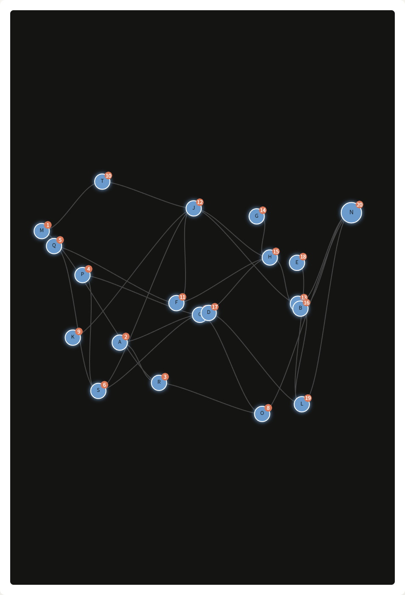
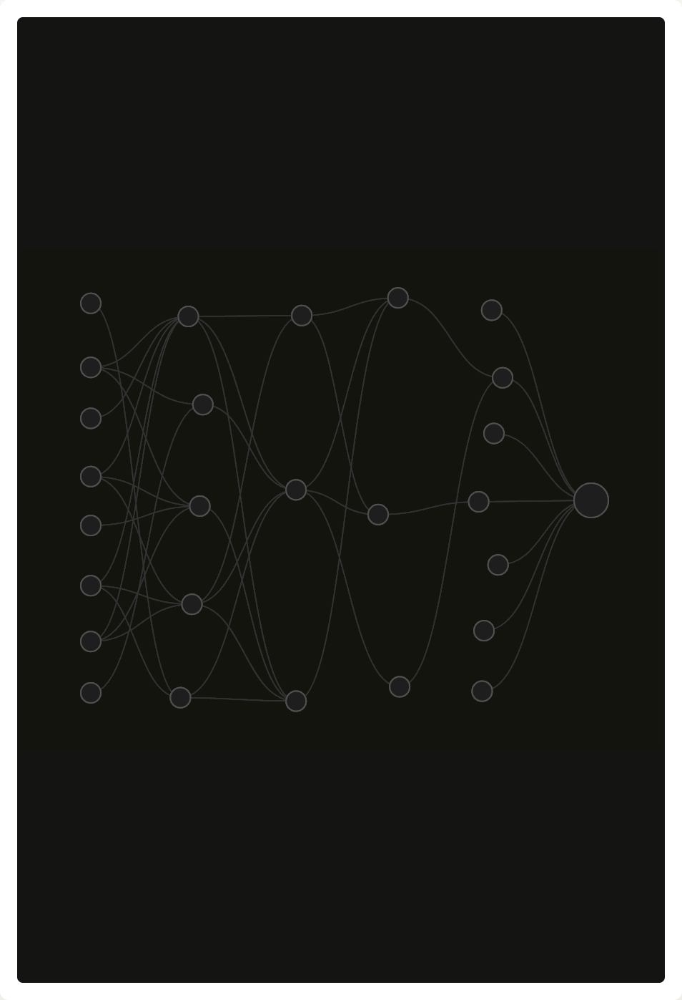
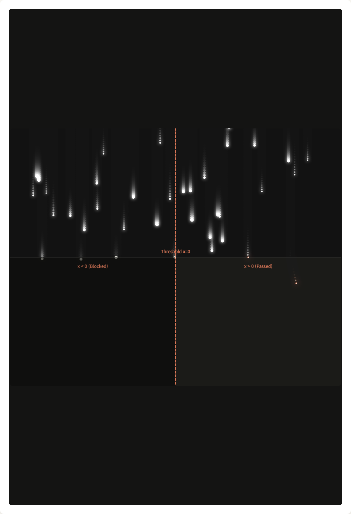

# Chapter 3. 위상 정렬 (Topological Sorting)

모든 데이터 처리가 끝났다면 **어디서부터 미분값을 내려줄 것인지 "순서"를 매겨야 하는 순간**이 옵니다. 
부모(`v`)가 미분값(`v.grad`)을 나에게 주어야 비로소 내 전체 미분값(`child.grad`)을 구할 수 있으므로, 어떤 부모도 나보다 늦게 계산되어선 안 됩니다. 가장 마지막 노드(`Loss`)부터 최초 조상 노드들 순으로 내려오는 완벽한 일직선의 작업 순번 정하기를 위상 정렬이라고 합니다.

## 3-1. DFS 줄 세우기 알고리즘
어떤 트리에 수많은 가지들이 복잡하게 얽혀 있다면 재귀 호출(DFS 탐색)을 통해 족보의 맨 밑바닥(자식)까지 우선 찾아간 다음, **돌아나올 때(Return) 리스트의 마지막에 등록하는 방법**이 가장 안전합니다.

## 3-2. `build_topo` 함수 코드 분석
`microgpt.py` 220번째 줄의 `backward` 안쪽에 숨은 함수입니다.

```python
        topo = []           # 최종 정렬된 노드들이 들어갈 리스트
        visited = set()     # 중복 탐색 방지를 위한 Set (이미 처리한 노드 기록)

        def build_topo(v):
            if v not in visited:
                visited.add(v)  # 방문 체크
                for child in v._children:
                    build_topo(child) # 1) 손자, 증손자까지 끝없이 들어감 (자식이 먼저라는 뜻!)
                topo.append(v)        # 2) 더 이상 내려갈 자식이 없다면 나를 리스트에 등록

        build_topo(self) # 이 함수를 최초로 호출하는 `self`는 무조건 전체를 총괄하는 Loss(오차) 여야 함.
```
**핵심 원리**: 이 코드가 돌고 나면 `topo` 리스트의 맨 앞쪽에는 가장 최초 부모 노드들(가장 아래 자식)이 모이고, 맨 뒤쪽에는 최종 결과인 `Loss(나)`가 들어가게 됩니다. 우리는 이 리스트를 **반대로(`reversed`) 돌리면서 역추적**할 것입니다.

> 🎮 **[인터랙티브 시각화: 위상 정렬 (Topological Sort) 오케스트레이션](viz/viz_p3_02_topo_sort.html)** 
> 복잡하게 얽힌 노드들이 DFS 알고리즘 스텝에 따라 하나씩 점등되며 순번을 부여받는 시각적 오케스트레이션을 체험해 보세요.
> 

# Chapter 4. 역전파 (Backward Pass) 알고리즘

이제 위상 정렬로 구한 순서를 타고 내려가며 **Chapter 3** 에서 배운 연쇄 법칙을 파도타기처럼 뿌려줍니다(Backpropagation). 이것이 딥러닝에서 가중치(파라미터)들이 자기가 어떻게 변해야 지능적일지 깨우치는 순간입니다.

## 4-1. 루트 노드의 초기화
역전파의 시작은 언제나 가장 마지막 결과물(Loss)부터 시작해야 합니다. "Loss 자체를 Loss 입장에서 미세 변화시키면 결과가 얼마나 변하느냐?" 라는 질문의 미분값은 상수 **`1.0`** 입니다!

```python
# backward() 내부:
        # 역전파의 출발점인 나(Loss)의 기준점 기울기를 1.0으로 초기화
        self.grad = 1.0
```

## 4-2. 역전파 엔진 (역순 반복문)

이제 정해진 `topo`의 역방향으로 내려가며 **(나의 로컬 그래디언트) $\times$ (위에서 받은 글로벌 그래디언트)** 의 체인 룰을 실행해 자식들에게 계속해서 기울기 값을 누적(`+=`)해 넘겨주는 기차 놀이가 1바퀴 실행됩니다.

```python
        for v in reversed(topo):
            # v._children(자식들)과 v._local_grads(그 자식들에 대한 지역 미분값들)을 하나씩 꺼냄
            for child, local_grad in zip(v._children, v._local_grads):
                # 🎈 역전파의 핵심 줄 (Gradient Accumulation)
                child.grad += local_grad * v.grad
```

> 🎮 **[인터랙티브 시각화: 역전파 (Backward Pass) 시뮬레이션](viz/viz_p3_03_backward_pass.html)** 
> 최종 결과 노드(Loss)에서 출발한 오류 신호가 엣지를 거꾸로 타고 올라가며 각 브랜치에서 그래디언트가 누적되는 모습을 체험해 보세요.
> 

# Chapter 5. 활성화 함수와 비선형성 (ReLU)

우리가 아무리 많은 노드를 거쳐 수천 번의 곱하기나 더하기를 연달아 한다 한들, 선형 수식들의 중첩은 결국 또 하나의 거대한 선형 변환식 행렬($Y=MX$) 하나로 무너져 내려버립니다.

## 5-1. 왜 비선형성이 필요한가?
이런 이유로 똑똑한 신경망이 입력 데이터 속의 곡선과 원, 복잡한 패턴과 의미 체계를 학습하게 해주려면 중간중간마다 "선을 구부리거나 자르는" 함수(Non-linear function)를 필터처럼 끼워 두어야 합니다. 

## 5-2. ReLU (Rectified Linear Unit) 동작과 미분
현재 딥러닝(GPT 포함)에서 가장 많이 사용하는 활성화 함수는 **`relu`** 입니다. 아주 단순하게 특정 노드의 값이 0보다 작으면 완전히 죽여버려서(0을 반환) 전기 신호를 끊고, 0보다 크면 받은 만큼 그대로 살려서 통과시킵니다.

```python
    # microgpt.py 줄 132
    def relu(self):
        # 0 과 자신의 데이터 중 큰 놈을 반환 (0 이하라면 무조건 0이 됨)
        # 로컬 미분: 나 자신이 양수였으면 1 (기울기가 그대로 1로 통과)
        # 나 자신이 음수(또는 0)였으면 0 (위에서 오던 글로벌 기울기를 0을 곱해서 소멸시켜버림!)
        return Value(
            max(0, self.data), 
            (self,), 
            # (self.data > 0) 의 결과값인 True/False 를 실수(1.0 이나 0.0)로 변환
            (float(self.data > 0),)  
        )
```

> ✅ **실제 값 적용 예제 (`relu`)**
> * 노드를 타고 흘러온 스칼라 값이 **`10.5`** 인 경우:  `10.5 > 0` 이므로 결과는 10.5가 통과하며, 로컬 미분도 **`1.0`**이 되어 역전파의 흐름을 방해하지 않고 살아서 올라온 만큼 밑으로 넘겨줍니다.
> * 반대로 노드의 스칼라 값이 **`-5.2`** 인 경우: `0과 -5.2 중 큰 놈`은 0초과가 아니므로 결과는 0이 되며, 미분 공식도 **`0.0`** 이 됩니다. 즉, 역전파가 자식으로 흘러가는 파이프의 수도꼭지를 완전히 잠가버립니다(Dead Neuron 현상의 원인).

> 🎮 **[인터랙티브 시각화: 비선형성 (ReLU) 차단 효과](viz/viz_p3_04_relu.html)** 
> 음수 영역과 양수 영역이 나뉜 공간에서 임계선을 넘는 파티클과 소멸하는 파티클의 움직임을 통해 선형성 배제를 시각적으로 체험해 보세요.
> 

---

여기까지 오셨다면!
드디어 `microgpt.py` 에서 수만 번 반복되는 **"Value 라는 데이터 구조가 그래프를 만들고, 꼬리를 물며 재귀적으로 미분값을 1번 만에 찾아내는 과정(Autograd Engine)"**의 코어를 **100% 완벽히 이해**하신 것입니다. 

마지막 가장 어려운 최종장 **Phase 4: Autograd Engine 실전 구현 및 분석 (마무리 지식 조립)** 에서는 이러한 기초 단위(Node)들을 잇고 모아 거대한 `Linear`, `Softmax`, 나아가 `GPT`라는 파라미터 구조를 조립해내는 파이썬 신경망 구현체를 다루게 됩니다.
