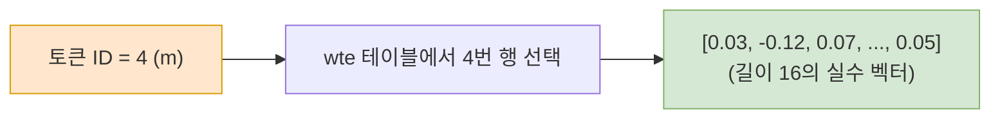

# Chapter 6. 토큰화(Tokenization)와 임베딩(Embedding)

인간이 읽는 글자(문자)를 신경망이 이해할 수 있는 숫자(벡터)로 바꾸는 과정입니다. `microgpt.py`의 **가장 첫 번째 처리 단계**이며, 이 과정 없이는 어떤 텍스트 데이터도 모델에 입력할 수 없습니다.

## 6-1. 토큰화 (Tokenization)

### 왜 토큰화가 필요한가?
신경망은 **숫자 연산만** 할 수 있습니다. 문자열 `"hello"`를 직접 곱하거나 더할 수는 없으므로, 먼저 각 문자를 고유한 정수 번호(ID)로 바꿔야 합니다. 이 변환 과정을 **토큰화(Tokenization)**라고 합니다.

### `microgpt.py`의 토큰화 방식 (문자 단위)
```python
# 25줄: 데이터셋에 등장하는 모든 유니크한 문자를 정렬하여 추출
uchars = sorted(set(''.join(docs)))
# 예: docs = ["emma", "olivia"] 라면
# ''.join(docs) = "emmaolivia"
# set(...) = {'a', 'e', 'i', 'l', 'm', 'o', 'v'}  (중복 제거)
# sorted(...) = ['a', 'e', 'i', 'l', 'm', 'o', 'v'] (정렬)
```

각 문자의 **정렬된 위치(index)**가 곧 토큰 ID가 됩니다:

| 문자 | 토큰 ID |
|------|---------|
| `a` | 0 |
| `e` | 1 |
| `i` | 2 |
| `l` | 3 |
| `m` | 4 |
| `o` | 5 |
| `v` | 6 |

```python
# 377줄: 문자열을 토큰 ID 시퀀스로 변환
doc = "emma"
tokens = [uchars.index(ch) for ch in doc]
# 'e'→1, 'm'→4, 'm'→4, 'a'→0
# tokens = [1, 4, 4, 0]
```

### BOS 토큰 (Beginning of Sequence)
```python
# 26줄: BOS 토큰은 기존 문자들 뒤에 하나 더 추가된 특별한 ID
BOS = len(uchars)   # 예: 26 (알파벳 a~z일 경우)
vocab_size = len(uchars) + 1  # 27 (26개 문자 + BOS 1개)
```

BOS는 **"문장의 시작"**을 알리는 마커 역할입니다. 모델에게 "지금부터 새로운 이름이 시작된다"고 신호를 보냅니다.

```python
# 377줄: 토큰 시퀀스의 양 끝을 BOS로 감싸기
tokens = [BOS] + [uchars.index(ch) for ch in doc] + [BOS]
# "emma" → [26, 1, 4, 4, 0, 26]
#           ^시작              ^끝(다음 토큰 예측의 정답 역할)
```

**핵심 포인트**: 끝에 붙는 BOS는 "이 이름은 여기서 끝난다"는 종료 신호 역할을 겸합니다. 모델이 이름 생성을 끝내야 할 시점을 학습하기 위해서입니다.


## 6-2. 토큰 임베딩 (Token Embedding)

### 정수 ID만으로는 부족하다
토큰 ID `4`(m)와 `5`(o)는 숫자 상으로 가까워 보이지만, 실제 문자 간의 관계와는 아무 상관이 없습니다. 단순 정수는 **의미적 관계를 표현할 수 없습니다.**

### 룩업 테이블 방식
임베딩은 각 토큰 ID에 대해 **미리 준비해둔 실수 벡터**를 꺼내는 것입니다. 마치 사전에서 단어 번호로 뜻을 찾는 것과 같습니다.

```python
# 248줄: wte(Word Token Embedding) 가중치 행렬 생성
# [vocab_size × n_embd] 크기 = [27 × 16] 행렬
state_dict['wte'] = matrix(vocab_size, n_embd)

# 328줄: 토큰 ID로 해당 행(row)을 "선택"하여 가져옴
tok_emb = state_dict['wte'][token_id]
# token_id=4 이면 → wte의 4번째 행 = 길이 16짜리 Value 벡터
```



**핵심 포인트**: 이 벡터의 초기값은 랜덤이지만, 학습이 진행되면서 비슷한 역할을 하는 문자들(예: 모음끼리)의 벡터가 자연스럽게 가까워지게 됩니다. 이것이 신경망이 "의미"를 배우는 방식입니다.


## 6-3. 위치 임베딩 (Position Embedding)

### 왜 위치 정보가 필요한가?
"cat"과 "tac"은 같은 글자로 이루어져 있지만 완전히 다른 단어입니다. 그런데 단순 토큰 임베딩만으로는 **글자의 순서를 구별할 수 없습니다.** 위치 임베딩은 "이 글자가 몇 번째 자리에 있는지"를 벡터에 추가로 새겨넣습니다.

```python
# 248줄: wpe(Word Position Embedding) 가중치 행렬 생성
# [block_size × n_embd] 크기 = [16 × 16] 행렬
# block_size=16: 최대 16글자까지의 위치를 표현 가능
state_dict['wpe'] = matrix(block_size, n_embd)

# 329줄: 현재 위치(pos_id)에 해당하는 위치 벡터 꺼내기
pos_emb = state_dict['wpe'][pos_id]
```

### 토큰 임베딩 + 위치 임베딩 = 최종 입력
```python
# 330줄: 두 벡터를 원소별(element-wise)로 더함
x = [t + p for t, p in zip(tok_emb, pos_emb)]
# 결과: 길이 16인 벡터 → "어떤 글자인지" + "몇 번째 위치인지" 정보를 동시에 담음
```

> ✅ **실제 흐름 예제 ("emma" 의 첫 번째 글자 'e' 처리)**
> 1. `token_id = 1` (e의 토큰 ID)
> 2. `pos_id = 0` (첫 번째 위치, BOS 다음)
> 3. `tok_emb = wte[1]` → 길이 16 벡터 (e라는 글자의 의미)
> 4. `pos_emb = wpe[0]` → 길이 16 벡터 (0번째라는 위치 정보)
> 5. `x = tok_emb + pos_emb` → 두 정보가 합쳐진 최종 입력 벡터

---

이렇게 **문자 → 정수 → 벡터** 의 변환 파이프라인이 완성되면, 이 벡터가 트랜스포머의 어텐션 블록으로 들어갑니다. 다음 Chapter 7에서 이 벡터가 어떻게 처리되는지 알아봅니다.

---
| ← [이전 챕터 (Chapter 3, 4, 5)](03_chapter_03_04_05.md) | [목록으로 (Plan)](01_plan.md) | [다음 챕터 (Chapter 7)](05_chapter_07.md) → |
