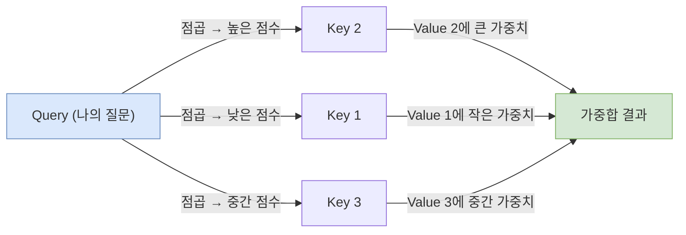
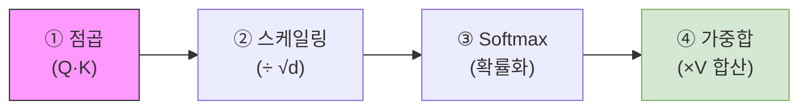
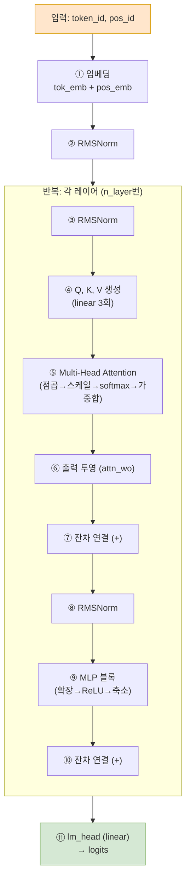

# Chapter 7. 어텐션 메커니즘과 트랜스포머

GPT 트랜스포머의 심장부인 **어텐션(Attention)** 메커니즘을 직관적으로 이해합니다. `microgpt.py`의 `gpt()` 함수(314~364줄)가 바로 이 구조의 실제 구현체입니다.

## 7-1. 어텐션(Attention)의 직관: 도서관 검색 비유

### "어디에 집중할 것인가?"
문장 "나는 사과를 먹었다"에서 "먹었다"를 예측하려면, 모든 단어가 동일하게 중요한 것이 아니라 **"사과를"**에 특히 주의(Attention)를 기울여야 합니다. 어텐션은 이처럼 **각 위치의 정보에 다른 가중치(중요도)를 부여하여 선별적으로 정보를 취합하는 메커니즘**입니다.

### 도서관 비유: Query, Key, Value
| 역할 | 비유 | 설명 |
|------|------|------|
| **Query (질문)** | 내가 찾고 싶은 주제 | "현재 위치에서 **무엇을 알고 싶은가?**" |
| **Key (색인)** | 각 책에 붙은 라벨 | "각 과거 위치가 **어떤 정보를 가지고 있는가?**" |
| **Value (내용)** | 책의 실제 내용 | "그 위치가 **실제로 전달할 정보**" |

**작동 원리**: Query와 모든 Key를 비교(점곱)하여 **유사도 점수**를 계산하고, 이 점수를 가중치로 사용하여 Value들의 **가중합**을 구합니다.



### 💻 코드 반영 (337~339줄)
```python
# x: 현재 위치의 입력 벡터 (길이 16)
# 가중치 행렬을 곱해서 Q, K, V 세 벡터를 생성
q = linear(x, state_dict[f'layer{li}.attn_wq'])  # Query 생성
k = linear(x, state_dict[f'layer{li}.attn_wk'])  # Key 생성
v = linear(x, state_dict[f'layer{li}.attn_wv'])  # Value 생성
```


## 7-2. 스케일드 닷 프로덕트 어텐션 (4단계 흐름)

Q, K, V가 준비되면 아래 4단계를 거쳐 어텐션 결과를 구합니다.

### 1단계: 점곱 (Dot Product)
Query와 각 과거 위치의 Key를 점곱(내적)하여 유사도 점수를 계산합니다.
```python
# 348줄: q_h와 과거의 모든 k_h를 점곱
attn_logits = [
    sum(q_h[j] * k_h[t][j] for j in range(head_dim))  # 점곱 = ∑(q × k)
    for t in range(len(k_h))  # 모든 과거 위치에 대해
]
# 결과: [3.2, 1.5, 0.8, ...] 같은 유사도 점수 리스트
```

### 2단계: 스케일링 (/ √d)
점곱 결과가 벡터 차원(d)에 비례하여 커지므로, `√d`로 나누어 안정적인 범위로 줄입니다.
```python
# 348줄 끝부분의 / head_dim**0.5
attn_logits = [... / head_dim**0.5 for t in range(len(k_h))]
# head_dim=4 이면 √4 = 2.0 으로 나눔
```

> **💡 왜 나누는가?** 차원이 클수록 점곱 결과가 극단적으로 커져서 소프트맥스 출력이 거의 원-핫(하나만 1, 나머지 0)이 됩니다. 이러면 학습이 어려우므로, 적절한 크기로 맞춰줍니다.

### 3단계: 소프트맥스 → 확률(가중치)
```python
# 349줄: 유사도 점수를 확률로 변환
attn_weights = softmax(attn_logits)
# [3.2, 1.5, 0.8] → [0.65, 0.25, 0.10] (합 = 1.0)
```

### 4단계: 가중합 (Weighted Sum)
```python
# 350줄: Value 벡터들을 확률 가중치로 합산
head_out = [
    sum(attn_weights[t] * v_h[t][j] for t in range(len(v_h)))
    for j in range(head_dim)
]
# 65%의 Value1 + 25%의 Value2 + 10%의 Value3 = 최종 결과
```




## 7-3. 멀티 헤드 어텐션 (Multi-Head Attention)

### 왜 여러 개의 헤드로 나누는가?
하나의 어텐션 헤드는 하나의 **관점**만 볼 수 있습니다. 예를 들어 "나는 빨간 사과를 먹었다"에서:
- **헤드 1**: "먹었다"와 연관된 **목적어**(사과를)에 집중
- **헤드 2**: "사과"의 **수식어**(빨간)에 집중
- **헤드 3**: **문법적 구조**(나는 ... 먹었다)에 집중

복수의 관점을 동시에 활용하면 더 풍부한 정보를 포착할 수 있습니다.

### 구현 방식: 벡터를 쪼개서 병렬 처리
```python
# microgpt.py 설정 (245~246줄)
n_head = 4       # 어텐션 헤드 4개
head_dim = n_embd // n_head  # 16 ÷ 4 = 4 (각 헤드가 담당하는 차원 수)

# 343~351줄: 각 헤드가 자기 담당 구간을 슬라이싱
for h in range(n_head):     # 4번 반복 (헤드 0, 1, 2, 3)
    hs = h * head_dim       # 시작 인덱스: 0, 4, 8, 12
    q_h = q[hs:hs+head_dim] # 전체 Q 벡터에서 내 구간만 잘라옴
    # ... 각 헤드가 독립적으로 어텐션 수행 ...
    x_attn.extend(head_out) # 결과를 이어붙임
```

| 헤드 | 담당 구간 | q, k, v 슬라이스 |
|------|----------|-------------------|
| 헤드 0 | `[0:4]` | 벡터의 0~3번 차원 |
| 헤드 1 | `[4:8]` | 벡터의 4~7번 차원 |
| 헤드 2 | `[8:12]` | 벡터의 8~11번 차원 |
| 헤드 3 | `[12:16]` | 벡터의 12~15번 차원 |

### KV 캐시 (Key-Value Cache)
```python
# 340~341줄: 현재 위치의 K, V를 리스트에 누적 저장
keys[li].append(k)    # 이전 위치들의 Key가 계속 쌓임
values[li].append(v)  # 이전 위치들의 Value가 계속 쌓임
```
GPT는 토큰을 **한 번에 하나씩** 생성합니다. 새 토큰을 처리할 때 과거 모든 토큰의 K, V가 필요하므로, 매번 다시 계산하지 않고 리스트에 쌓아두는 것이 KV 캐시입니다.


## 7-4. MLP (Feed-Forward) 블록

어텐션이 "어디로부터 정보를 가져올지" 결정했다면, MLP는 그 정보를 **가공하고 변환**하는 역할을 합니다.

```python
# 355~361줄: 2층 신경망 (확장 → 비선형성 → 축소)
x_residual = x
x = rmsnorm(x)

# 1층: 차원을 4배로 확장 (16 → 64)
x = linear(x, state_dict[f'layer{li}.mlp_fc1'])  # [n_embd → 4*n_embd]

# 비선형성 적용 (음수를 죽이고 양수만 통과)
x = [xi.relu() for xi in x]

# 2층: 다시 원래 차원으로 축소 (64 → 16)
x = linear(x, state_dict[f'layer{li}.mlp_fc2'])  # [4*n_embd → n_embd]

# 잔차 연결 (Chapter 8에서 상세 설명)
x = [a + b for a, b in zip(x, x_residual)]
```

**💡 왜 확장했다가 다시 줄이는가?** 차원을 넓혀서 더 복잡한 패턴을 포착할 여유를 주고, ReLU로 불필요한 부분을 걸러낸 뒤, 다시 원래 크기로 압축하여 핵심 정보만 남기는 병목(Bottleneck) 구조입니다.


## 7-5. `gpt()` 함수 전체 흐름 정리

`microgpt.py`의 `gpt()` 함수(314~364줄)가 한 번 호출될 때의 데이터 흐름 전체를 정리합니다.



| 단계 | 코드 줄 | 설명 |
|------|---------|------|
| ① 임베딩 | 328~330 | 토큰 + 위치 임베딩 합산 |
| ② 초기 정규화 | 331 | 입력 벡터 정규화 |
| ③~⑩ 레이어 반복 | 333~361 | 어텐션 + MLP + 잔차 연결 |
| ⑪ 최종 출력 | 363 | 임베딩 차원 → 어휘 크기로 변환, 각 토큰의 확률 점수(logit) |

**핵심 포인트**: `logits`는 길이가 `vocab_size`(27)인 리스트로, 각 원소는 다음에 올 글자가 해당 문자일 가능성을 나타내는 점수입니다. 이 로짓을 `softmax()`에 넣으면 확률 분포가 됩니다.

---

이제 트랜스포머의 전체 구조를 이해했습니다! 다음 Chapter 8에서는 위 과정에서 반복적으로 등장한 **RMSNorm**과 **잔차 연결**이 왜 신경망 학습에 필수적인지 배웁니다.

---
| ← [이전 챕터 (Chapter 6)](04_chapter_06.md) | [목록으로 (Plan)](01_plan.md) | [다음 챕터 (Chapter 8)](06_chapter_08.md) → |
