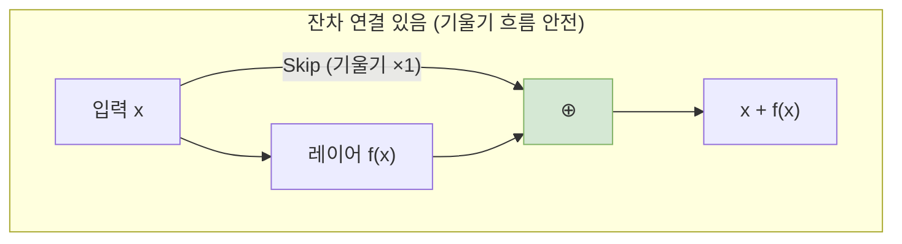

# Chapter 8. 정규화(Normalization)와 잔차 연결(Residual Connection)

트랜스포머(GPT)가 깊은 층을 쌓아도 학습이 붕괴되지 않게 해주는 두 가지 핵심 안전장치입니다. `microgpt.py`에서 `rmsnorm()` 함수와 `x = [a + b for a, b in zip(x, x_residual)]` 패턴이 바로 이 역할을 합니다.

## 8-1. 왜 정규화가 필요한가?

### 값 폭발과 소멸 문제
신경망에서 데이터가 여러 레이어를 지나며 계속 곱해지고 더해지다 보면:
- **값 폭발(Exploding)**: 수치가 점점 커져서 `1e+30` 같은 거대한 수가 되어버림
- **값 소멸(Vanishing)**: 수치가 점점 작아져서 `1e-30` 처럼 0에 가까워져 정보가 사라짐

두 경우 모두 학습이 불가능해집니다. 정규화는 **각 레이어를 지날 때마다 값의 크기를 일정한 범위로 다시 맞춰주는** 역할을 합니다.

### 비유: 볼륨 조절기
음악을 여러 앰프에 연결해서 들을 때, 각 앰프 사이에 볼륨 조절기(정규화)를 두지 않으면 소리가 너무 커지거나 아예 들리지 않게 됩니다.


## 8-2. RMSNorm 함수의 동작

`microgpt.py`에서는 표준적인 LayerNorm 대신 더 간단한 **RMS Normalization**을 사용합니다. (코드 주석: "layernorm -> rmsnorm")

### 수학 공식

$$\text{RMSNorm}(x_i) = \frac{x_i}{\sqrt{\frac{1}{n} \sum_{j=1}^{n} x_j^2 + \epsilon}}$$

쉽게 풀면:
1. 벡터의 모든 원소를 **제곱**하고
2. **평균**을 낸 뒤 (Mean Square)
3. **제곱근**을 취하고 (Root)
4. 원래 벡터를 이 값으로 **나눕니다**

결과적으로 벡터의 크기(norm)가 대략 1 근처로 맞춰집니다.

### 💻 코드 반영 (`rmsnorm` 함수, 296~312줄)
```python
def rmsnorm(x):
    # 1. 각 원소를 제곱하고 평균 (Mean Square)
    ms = sum(xi * xi for xi in x) / len(x)
    
    # 2. 역수의 제곱근 계산 (1 / √(ms + ε))
    # +1e-5: 만약 ms가 정확히 0이면 0으로 나누는 오류 발생! 아주 작은 수(ε)를 더해 방지
    scale = (ms + 1e-5) ** -0.5
    
    # 3. 모든 원소에 같은 스케일을 곱해 정규화
    return [xi * scale for xi in x]
```

> ✅ **실제 값 적용 예제**
> * **입력 벡터**: $x = [3.0, -4.0, 0.0, 1.0]$
> * **Mean Square**: $(9 + 16 + 0 + 1) / 4 = 6.5$
> * **scale**: $1 / \sqrt{6.5 + 0.00001} \approx 0.3922$
> * **결과**: $[3.0 \times 0.39, -4.0 \times 0.39, 0.0 \times 0.39, 1.0 \times 0.39]$
> * $= [1.18, -1.57, 0.0, 0.39]$ → 값의 크기가 $\pm 2$ 이내로 안정화!

### `epsilon (1e-5)` 의 의미
만약 벡터의 모든 값이 0이면 `ms = 0`이 되고, `0 ** -0.5`는 **0으로 나누기 오류**가 됩니다. 극히 작은 양수(`0.00001`)를 더해서 이 상황을 방지합니다. 결과에는 사실상 영향을 주지 않습니다.

### RMSNorm vs LayerNorm
| | LayerNorm | RMSNorm |
|---|-----------|---------|
| 평균 차감 | ✅ (평균을 빼서 중심을 0로 맞춤) | ❌ (안 함) |
| 분산 정규화 | ✅ | ✅ (RMS 사용) |
| 학습 파라미터 (γ, β) | ✅ | ❌ (microgpt에선 생략) |
| 계산 비용 | 더 높음 | **더 낮음** (빈곤한 `Value` 엔진에 적합) |

`microgpt.py`에서 RMSNorm을 선택한 이유: 스칼라 기반 Autograd 엔진에서 계산을 최소화하면서도 충분한 정규화 효과를 얻기 위해서입니다.


## 8-3. 잔차 연결 (Residual/Skip Connection)

### 핵심 아이디어: `output = f(x) + x`
레이어의 출력에 **입력을 그대로 더해주는** 단순한 트릭입니다. 이름 그대로 입력이 변환을 "건너뛰어서(skip)" 출력에 직접 합류합니다.

```python
# 어텐션 블록의 잔차 연결 (353줄)
x_residual = x              # 입력 저장
x = ... (어텐션 연산) ...    # 변환된 결과
x = [a + b for a, b in zip(x, x_residual)]  # 출력 = 변환 + 원본

# MLP 블록의 잔차 연결 (356, 361줄)
x_residual = x              # 입력 저장
x = ... (MLP 연산) ...      # 변환된 결과
x = [a + b for a, b in zip(x, x_residual)]  # 출력 = 변환 + 원본
```

### 왜 효과적인가?

**1. 기울기 소실 방지**
역전파 시 덧셈 노드의 로컬 그래디언트는 **1** 입니다(Phase 2 Chapter 2에서 배움). 따라서 잔차 연결 경로로는 기울기가 **아무런 감쇠 없이** 깊은 층까지 도달할 수 있습니다.



**2. 학습의 용이성**
레이어가 학습할 대상이 `f(x) = 목표출력` 에서 `f(x) = 목표출력 - x` (잔차)로 바뀝니다. 만약 현재 레이어가 아무것도 배울 필요가 없다면, 가중치를 전부 0으로 만들어 `f(x) = 0` 으로 두면 됩니다. 그러면 출력은 `0 + x = x`, 즉 입력이 그대로 통과합니다. 이처럼 "아무것도 안 하는 것"이 기본값이 되어, 네트워크가 필요한 만큼만 변환을 배우면 됩니다.

### 코드 주석의 의미
```python
# 331줄: "note: not redundant due to backward pass via the residual connection"
# 번역: "잔차 연결을 통한 역전파 때문에 (초기 정규화가) 불필요하지 않음"
x = rmsnorm(x)
```
이 주석은 "임베딩 직후에 하는 RMSNorm은 그 다음 레이어가 다시 RMSNorm을 하므로 불필요해 보일 수 있지만, 잔차 연결을 통해 정규화되지 않은 값이 직접 더해지므로 실제로는 필요하다"는 의미입니다.

---

이것으로 **Phase 3 (딥러닝 코어 이론)** 의 모든 내용이 완성되었습니다! 계산 그래프(Ch.1~2), 위상 정렬과 역전파(Ch.3~4), 비선형성(Ch.5), 토큰화와 임베딩(Ch.6), 어텐션과 트랜스포머(Ch.7), 정규화와 잔차 연결(Ch.8)까지,이제 딥러닝 시스템을 구성하는 모든 이론적 벽돌(계산 그래프, 역전파, ReLU, 어텐션, RMSNorm)을 준비했습니다. Phase 4에서는 이 모든 것들을 `microgpt.py` 원본 코드의 실제 구현체로 결합하는 마지막 도전을 시작합니다.

---
| ← [이전 챕터 (Chapter 7)](05_chapter_07.md) | [목록으로 (Plan)](01_plan.md) | [다음 Phase (Phase 4) 계획서](../phase04_autograd/01_plan.md) → |
